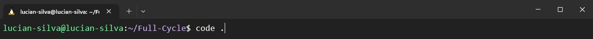
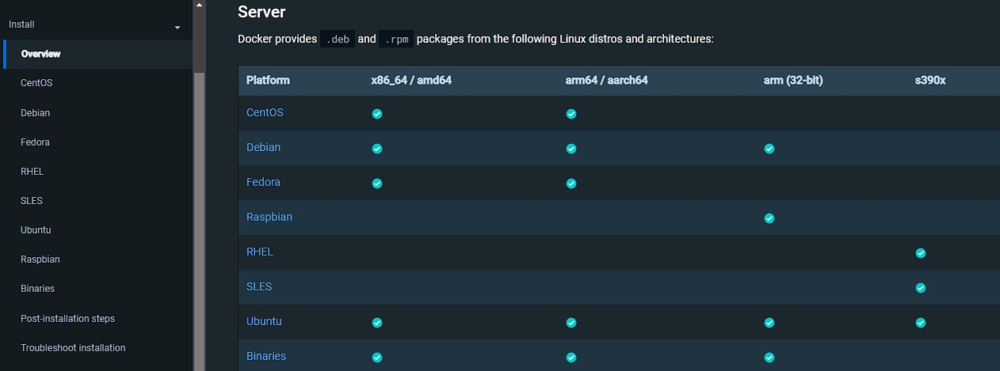

# Instalação Docker

## Windows 10 / 11 :

É importante que tudo o que formos instalar para fins de desenvolvimento seja instalado dentro do `WSL`, enquanto estiver desenvolvendo pense apenas no `WSL (Linux)`.

Abaixo temos um link que ao clicar você será direcionado para o tutorial de instalação e configuração do `WSL (Linux)`.

Link: [Tutorial WSL](https://github.com/codeedu/wsl2-docker-quickstart)

Um passo importante antes de iniciar a instalação do `Docker` é verificar se há alguma atualização do `Windows` pendente, é importante manter o `Windows` atualizado, pois isso irá manter o `WSL` sempre com as últimas atualizações.

Antes de iniciar abra o terminal `DOS ou PowerShell` e execute o seguinte comando: 

`wsl --update`

Este comando irá atualizar o `WSL` caso haja algo a ser atualizado.

---

Não é recomendado a utilização do `Docker Desktop`, além de consumir muita memória `RAM` (Aproximadamente 2GB) e impactar em uma pequena parte de consumo do `CPU`.

Abaixo um vídeo sobre o Porque não é recomendado o uso do Docker Desktop.

Link: [https://www.youtube.com/watch?v=wpdcGgRY5kk](https://www.youtube.com/watch?v=wpdcGgRY5kk)

A única opção para utilizar o `Docker Desktop` é no seguinte cenário: quando precisamos trabalhar com `imagens baseadas em Windows` para `.NET` ou funcionalidades referente a `Microsoft`, veja que são casos específicos.

---

### Instalação:

É recomendado utilizar o Docker Engine, caso tenha instalado o Docker Desktop (Ele consome uma % (porcentagem) considerável de memória `RAM` e outros recursos do `Sistama Operacional`), por favor, não o utilize e siga as instruções abaixo para a instalação do Docker Engine na distribuição Linux `Ubuntu`. 

1. [- Agora instale os pacotes necessários para a instalação:](#1---agora-instale-os-pacotes-necessários-para-a-instalação)
2. [- Adicione a GPG key oficial do Docker:](#2---adicione-a-gpg-key-oficial-do-docker)
3. [- Set o repositório com o comando abaixo](#3---set-o-repositório-com-o-comando-abaixo)
4. [- Execute a apt update](#4---execute-a-apt-update)
5. [- Instale a versão mais atual](#5---instale-a-versão-mais-atual)
6. [- Teste executando o comando abaixo](#6---teste-executando-o-comando-abaixo)

### 1 - Agora instale os pacotes necessários para a instalação:

```bash
sudo apt-get update
sudo apt-get install ca-certificates curl gnupg
```

### 2 - Adicione a GPG key oficial do Docker:

```bash
sudo install -m 0755 -d /etc/apt/keyrings
curl -fsSL https://download.docker.com/linux/ubuntu/gpg | sudo gpg --dearmor -o /etc/apt/keyrings/docker.gpg
sudo chmod a+r /etc/apt/keyrings/docker.gpg
```

### 3 - Set o repositório com o comando abaixo:

```bash
echo \
  "deb [arch="$(dpkg --print-architecture)" signed-by=/etc/apt/keyrings/docker.gpg] https://download.docker.com/linux/ubuntu \
  "$(. /etc/os-release && echo "$VERSION_CODENAME")" stable" | \
  sudo tee /etc/apt/sources.list.d/docker.list > /dev/null
```

### 4 - Execute a apt update:

```bash
sudo apt-get update
```

### 5 - Instale a versão mais atual:

```bash
sudo apt-get install docker-ce docker-ce-cli containerd.io docker-buildx-plugin docker-compose-plugin
```

### 6 - Teste executando o comando abaixo:

```bash
sudo docker run hello-world
```

Depois de instalado, execute os seguinte passos para remover a necessidade de rodar o docker com sudo:

1. [- Adicione o seu usuário no grupo docker](#1---adicione-o-seu-usuário-no-grupo-docker)
2. [- Rode o comando sem o sudo](#2---rode-o-comando-sem-o-sudo)

### 1 - Adicione o seu usuário no grupo docker:

```bash
sudo usermod -aG docker $USER
```

### 2 - Rode o comando sem o sudo:

```bash
docker run hello-world
```

---

### Inicializando o Docker no Windows 10:

Observação importante: Sempre que iniciarmos o `WSL (Linux)`, precisamos rodar o comando: `sudo service docker start`

---

### Inicializando o Docker no Windows 11 :

Para iniciar o `Docker` precisamos sempre executar o comando `sudo service docker start`, mas no `Windows 11` podemos incluir um comando padrão para que ao iniciarmos o `WSL` o `Docker` também inicie.

Primeiro vamos editar o arquivo `/etc/wsl.conf`: 

Rode o comando: 

`code /etc/wsl.conf`

Inclua o seguinte código:

```
[boot]
command="service docker start" 
```

---

### Possível erro ao iniciar o `Docker` no `Ubuntu 22.04`:

Se ao tentar iniciar o `Docker` e receber o seguinte erro:

` Cannot connect to the Docker daemon at unix:///var/run/docker.sock. Is the docker daemon running? `

Rode o comando: `sudo update-alternatives --config iptables` e escolha a opção 1 `iptables-legacy`.

Rode novamente o comando: `sudo service docker start` e teste com o comando: `docker ps`, caso não receba mais nenhum erro tudo estará correto.

---

### Recomendações: `Windows 10 / 11`:

#### Caminhos de projetos:

É recomendado criarmos nossos projetos dentro do `WSL (Linux)`, pois gera uma melhor compatibilidade e conexão com diferentes ferramentas que poderemos utilizar, como: `Docker`, `linguagens de programação`, etc..., visto que sempre faremos as instalações dentro do `WSL (Linux)`.

Temos uma forma simples de realizar o `backup` do `WSL (Linux)`, vamos executar os comandos abaixo via terminal `DOS ou PowerShell`:

Para realizar o `backup` digite: 

`wsl --export Ubuntu C:\CAMINHO_A_SUA_ESCOLHA\NOME_DO_BACKUP.tar`

E para importar este `backup` digite: 

`wsl --import Ubuntu C:\CAMINHO_A_SUA_ESCOLHA\NOME_DO_BACKUP.tar`

Caso tenha algum projeto criado dentro de `C:` sugerimos que seja transferido para dentro do `WSL (Linux)`.

Este é um ponto muito importante, sempre que criar novos projetos eles devem ser criados dentro de: 

`/home/SEU_USER`

---

## Instalação recomendada no VSCode:

Uma extensão importante que precisamos ter instalada é o `WSL`:


Após realizar a instalação da extensão acima, abra o terminal do `WSL (Linux)` e vá até a pasta do projeto que queira abrir e rode o comando: `code .` e o `VSCode` será aberto.



Quando abrir o projeto com o `VSCode` repare se o icone abaixo a esquerda esta da seguinte forma:


Caso não esteja aparecendo `WSL:Ubuntu` podemos perder performance e o projeto não será visualizado de forma correta:


---

## Windows Terminal:

Recomendamos também o uso do `Windows Terminal`, que é uma aplicação moderna para uso de `shells`, os principais recursos vão desde, várias guias (abas) facilitando a troca de um terminal para outro, painéis, opção de criar os próprios temas e personalizar texto, cores, etc....

Link: [https://www.microsoft.com/store/productId/9N0DX20HK701](https://www.microsoft.com/store/productId/9N0DX20HK701)

A configuração para deixar o `Terminal do WSL (Linux)` como padrão está na aba do tutorial do `WSL` 

# Linux

É recomendado utilizar o Docker Engine, caso tenha instalado o Docker Desktop (Ele consome uma % (porcentagem) considerável de memória `RAM` e outros recursos do `Sistama Operacional`), por favor, não o utilize e siga as instruções abaixo para a instalação do Docker Engine na distribuição Linux `Ubuntu`. 

O passo a passo abaixo será direcionado para a distribuição `Ubuntu`, mas caso esteja em outra distribuição clique no link abaixo e terá um melhor direcionamento para seguir com a instalação:

* [Outras distros Linux](#outras-distros-linux)

---

* [Desinstale todas as versões do `Docker Engine` anteriores com o seguinte comando](#desinstale-todas-as-versões-do-docker-engine-anteriores-com-o-seguinte-comando)
1. [- Agora instale os pacotes necessários para a instalação](#1---agora-instale-os-pacotes-necessc3a1rios-para-a-instalac3a7c3a3o-2)
2. [- Adicione a GPG key oficial do Docker](#2---adicione-a-gpg-key-oficial-do-docker-2)
3. [- Set o repositório com o comando abaixo](#3---set-o-repositc3b3rio-com-o-comando-abaixo-2)
4. [- Execute a apt update](#4---execute-a-apt-update-2)
5. [- Instale a versão mais atual](#5---instale-a-versc3a3o-mais-atual-2)
6. [- Teste executando o comando abaixo](#6---teste-executando-o-comando-abaixo-2)

### Desinstale todas as versões do `Docker Engine` anteriores com o seguinte comando:

```bash
sudo apt-get remove docker docker-engine docker.io containerd runc
```

### 1 - Agora instale os pacotes necessários para a instalação:

```bash
sudo apt-get update
sudo apt-get install ca-certificates curl gnupg
```

### 2 - Adicione a GPG key oficial do Docker:

```bash
sudo install -m 0755 -d /etc/apt/keyrings
curl -fsSL https://download.docker.com/linux/ubuntu/gpg | sudo gpg --dearmor -o /etc/apt/keyrings/docker.gpg
sudo chmod a+r /etc/apt/keyrings/docker.gpg
```

### 3 - Set o repositório com o comando abaixo:

```bash
echo \
  "deb [arch="$(dpkg --print-architecture)" signed-by=/etc/apt/keyrings/docker.gpg] https://download.docker.com/linux/ubuntu \
  "$(. /etc/os-release && echo "$VERSION_CODENAME")" stable" | \
  sudo tee /etc/apt/sources.list.d/docker.list > /dev/null
```

### 4 - Execute a apt update:

```bash
sudo apt-get update
```

### 5 - Instale a versão mais atual:

```bash
sudo apt-get install docker-ce docker-ce-cli containerd.io docker-buildx-plugin docker-compose-plugin
```

### 6 - Teste executando o comando abaixo:

```bash
sudo docker run hello-world
```

1. [- Adicione o seu usuário no grupo docker](#1---adicione-o-seu-usuc3a1rio-no-grupo-docker-2)
2. [- Rode o comando sem o sudo](#2---rode-o-comando-sem-o-sudo-2)

Depois de instalado, execute os seguinte passos para remover a necessidade de rodar o docker com sudo:

### 1 - Adicione o seu usuário no grupo docker:

```bash
sudo usermod -aG docker $USER
```

### 2 - Rode o comando sem o sudo:

```bash
docker run hello-world
```

---

## Outras distros Linux

Para realizar a instalação do `Docker` em outras distro `Linux` veja o link abaixo e siga os passos recomendados pela documentação oficial:

Link: [https://docs.docker.com/engine/install/#server](https://docs.docker.com/engine/install/#server)



---

# MacOs

Para a instalação do `Docker` no `MacOs M1 e Intel` precisamos utilizar o `Docker Desktop`.

Basta acessar o link abaixo e escolher o `chip` da sua máquina:

https://docs.docker.com/desktop/install/mac-install/