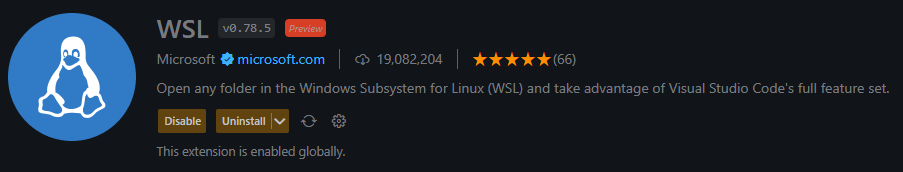
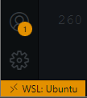
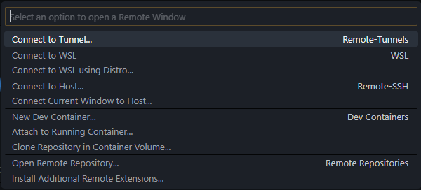

## Instalação Docker

## Windows

É importante que tudo o que formos instalar para fins de desenvolvimento e um melhor acompanhamento do curso seja instalado dentro do `WSL`, enquanto estivermos desenvolvendo pense apenas no `WSL (Linux)`.
//colocar link do WSL
---

//simplificar este paragráfo, dizendo que é para verificar atualização do Windows e que isto é importante porque o WSL é atualizado via Windows Update
Um passo importante antes de iniciar a instalação do `Docker` é verificar se não há alguma atualização do `Windows` pendente, para isso acesse `Configurações` e vá até o menu do `Windows Update`, confirme se existe alguma atualização a ser realizada, é importante manter o `Windows` atualizado, pois isso irá manter o `WSL` sempre com as últimas atualizações.

//Abrir o DOS ou PowerShell e rodar o wsl --update.

---

Não é recomendado a utilização do `Docker Desktop`, além de consumir muita memória `RAM` (Aproximadamente 2GB) e impactar em uma pequena parte de consumo do `CPU`.

Abaixo um vídeo sobre o Porque não é recomendado o uso do Docker Desktop.

### Link: https://www.youtube.com/watch?v=wpdcGgRY5kk

// se for necessário trabalhar com imagem baseadas em Windows
A única opção para utilizar o `Docker Desktop` é no seguinte cenário: quando precisamos trabalhar com `containers Windows` para `.NET` ou funcionalidades referente a `Microsoft`, veja que são casos específicos.

---

//remover
## Outras distros Linux

Para realizar a intalação do `Docker` em outras distro `Linux` veja o link abaixo e siga os passos recomendados pela documentação oficial:

### Link: https://docs.docker.com/engine/install/#server

---

## Windows 10

Pra termos bons resultados em relação às aulas, é importante usar o Docker Engine. Caso tenha instalado o Docker Desktop, por favor, desinstale e siga a instruções abaixo para instalação do Docker Engine na distruibição Linux Ubuntu. 

//aplicar uma formatação melhor para os tópicos
1 - Agora instale os pacotes necessários para a instalação:

```bash
sudo apt-get update
sudo apt-get install ca-certificates curl gnupg
```

2 - Adicione a GPG key oficial do Docker:

```bash
sudo install -m 0755 -d /etc/apt/keyrings
curl -fsSL https://download.docker.com/linux/ubuntu/gpg | sudo gpg --dearmor -o /etc/apt/keyrings/docker.gpg
sudo chmod a+r /etc/apt/keyrings/docker.gpg
```

3 - Set o repositório com o comando abaixo:

```bash
echo \
  "deb [arch="$(dpkg --print-architecture)" signed-by=/etc/apt/keyrings/docker.gpg] https://download.docker.com/linux/ubuntu \
  "$(. /etc/os-release && echo "$VERSION_CODENAME")" stable" | \
  sudo tee /etc/apt/sources.list.d/docker.list > /dev/null
```

4 - Execute a apt update:

```bash
sudo apt-get update
```

5 - Instale a versão mais atual

```bash
sudo apt-get install docker-ce docker-ce-cli containerd.io docker-buildx-plugin docker-compose-plugin
```

6 - Teste executando o comando abaixo

```bash
sudo docker run hello-world
```

Depois de instalado, execute os seguinte passos para remover a necessidade de rodar o docker com sudo:
//revisar
2 - Adicione o seu usuário no grupo docker

```bash
sudo usermod -aG docker $USER
```

4 - Rode o comando sem o sudo:

```bash
docker run hello-world
```

Observação importante: Sempre que iniciarmos o `WSL (Linux)`, precisamos rodar o comando: `sudo service docker start`

---

Possível erro ao iniciar o `Docker` no `Ubuntu 22.04`

Se ao tentar iniciar o `Docker` e receber o seguinte erro:

` Cannot connect to the Docker daemon at unix:///var/run/docker.sock. Is the docker daemon running? `

Rode o comando: `sudo update-alternatives --config iptables` e escolha a opção 1 `iptables-legacy`.

Rode novamente o comando: `sudo service docker start` e teste com o comando: `docker ps`, caso não receba mais nenhum erro tudo estará correto.

---

## Windows 11

Pra termos bons resultados em relação às aulas, é importante usar o Docker Engine. Caso tenha instalado o Docker Desktop, por favor, desinstale e siga a instruções abaixo para instalação do Docker Engine na distruibição Linux Ubuntu. 

1 - Agora instale os pacotes necessários para a isntalação:

```bash
sudo apt-get update
sudo apt-get install ca-certificates curl gnupg
```

2 - Adicione a GPG key oficial do Docker:

```bash
sudo install -m 0755 -d /etc/apt/keyrings
curl -fsSL https://download.docker.com/linux/ubuntu/gpg | sudo gpg --dearmor -o /etc/apt/keyrings/docker.gpg
sudo chmod a+r /etc/apt/keyrings/docker.gpg
```

3 - Set o repositório com o comando abaixo:

```bash
echo \
  "deb [arch="$(dpkg --print-architecture)" signed-by=/etc/apt/keyrings/docker.gpg] https://download.docker.com/linux/ubuntu \
  "$(. /etc/os-release && echo "$VERSION_CODENAME")" stable" | \
  sudo tee /etc/apt/sources.list.d/docker.list > /dev/null
```

4 - Execute a apt update:

```bash
sudo apt-get update
```

5 - Instale a versão mais atual

```bash
sudo apt-get install docker-ce docker-ce-cli containerd.io docker-buildx-plugin docker-compose-plugin
```

6 - Teste executando o comando abaixo

```bash
sudo docker run hello-world
```

Depois de instalado, execute os seguinte passos para remover a necessidade de rodar o docker com sudo:
//revisar
2 - Adicione o seu usuário no grupo docker

```bash
sudo usermod -aG docker $USER
```

4 - Rode o comando sem o sudo:

```bash
docker run hello-world
```

---

Possível erro ao iniciar o `Docker` no `Ubuntu 22.04`

Se ao tentar iniciar o `Docker` e receber o seguinte erro:

` Cannot connect to the Docker daemon at unix:///var/run/docker.sock. Is the docker daemon running? `

Rode o comando: `sudo update-alternatives --config iptables` e escolha a opção 1 `iptables-legacy`.

Rode novamente o comando: `sudo service docker start` e teste com o comando: `docker ps`, caso não receba mais nenhum erro tudo estará correto.

---
//revisar - colocar que é necessário rodar o comando sudo service docker start, mas é possível roda-lo automaticamente com WSL através do /etc/wsl.conf
No `Windows 11` podemos incluir um comando padrão para que o ao iniciarmos o `WSL` o `Docker` também incie.

Primeiro vamos editar o arquivo `/etc/wsl.conf`: 

Rode o comando: 

`code /etc/wsl.conf`

Inclua o seguinte código:

```
[boot]
command="service docker start" 
```

---

## Recomendações: `Windows 10 / 11`

### Caminhos de projetos:

//revisar - porque isto é importante
//se tiver com receio de colocar seus projetos dentro do WSL com medo de perde-los, é possível fazer backup do WSL de forma bem simples (executar DOS ou PowerShell):
//wsl --export Ubuntu C:\caminho\backup.tar
//para importar
//wsl --import Ubuntu C:\caminho\backup.tar
Caso tenha algum projeto criado dentro de `C:` sugerimos que sejam transferidos para dentro do `WSL (Linux)`.

E novos projetos devem ser criados dentro de: 

`/home/SEU_USER`

---

//VSCode
### Instalações necessárias:

Uma extensão importante que precisamos ter instalada é o `WSL`:

<a target="_blank" href="https://marketplace.visualstudio.com/items?itemName=ms-vscode-remote.remote-wsl">


</a>

Quando abrir o projeto com o `VsCode` repare se o icone abaixo a esquerda esta da seguinte forma:



Caso não esteja aparecendo "WSL:Ubuntu" podemos perder performance e o projeto não será visualizado de forma correta, para resolvermos isso clique no icone:


Uma modal será aberta no `VsCode` com algumas opções, selecione `Connect to WSL`:



---

### Windows Terminal:

Recomendamos também o uso do `Windows Terminal`, ele irá auxiliar caso precise mais de um terminal, ele possui a opção de abas.

Link: https://www.microsoft.com/store/productId/9N0DX20HK701

A configuração para deixar o `Terminal do WSL (Linux)` como padrão está na aba do tutorial do `WSL` 

    #(acrescente trecho de live sobre como fazer backup e restauração do WSL)

# Linux

Pra termos bons resultados em relação às aulas, é importante usar o Docker Engine. Caso tenha instalado o Docker Desktop, por favor, desinstale e siga a instruções abaixo para instalação do Docker Engine na distruibição Linux Ubuntu. 

//revisar - deixar claro que a desinstalação é para Docker Engine anteriores
Desinstale todas as versões anteriores com o seguinte comando:

```bash
sudo apt-get remove docker docker-engine docker.io containerd runc
```

1 - Agora instale os pacotes necessários para a isntalação:

```bash
sudo apt-get update
sudo apt-get install ca-certificates curl gnupg
```

2 - Adicione a GPG key oficial do Docker:

```bash
sudo install -m 0755 -d /etc/apt/keyrings
curl -fsSL https://download.docker.com/linux/ubuntu/gpg | sudo gpg --dearmor -o /etc/apt/keyrings/docker.gpg
sudo chmod a+r /etc/apt/keyrings/docker.gpg
```

3 - Set o repositório com o comando abaixo:

```bash
echo \
  "deb [arch="$(dpkg --print-architecture)" signed-by=/etc/apt/keyrings/docker.gpg] https://download.docker.com/linux/ubuntu \
  "$(. /etc/os-release && echo "$VERSION_CODENAME")" stable" | \
  sudo tee /etc/apt/sources.list.d/docker.list > /dev/null
```

4 - Execute a apt update:

```bash
sudo apt-get update
```

5 - Instale a versão mais atual

```bash
sudo apt-get install docker-ce docker-ce-cli containerd.io docker-buildx-plugin docker-compose-plugin
```

6 - Teste executando o comando abaixo

```bash
sudo docker run hello-world
```

Depois de instalado, execute os seguinte passos para remover a necessidade de rodar o docker com sudo:

//revisar
2 - Adicione o seu usuário no grupo docker

```bash
sudo usermod -aG docker $USER
```

4 - Rode o comando sem o sudo:

```bash
docker run hello-world
```

## Outras distros Linux

Para realizar a intalação do `Docker` em outras distro `Linux` veja o link abaixo e siga os passos recomendados pela documentação oficial:

### Link: https://docs.docker.com/engine/install/#server

---

# MacOs

Para a instalação do `Docker` no `MacOs M1 e Intel` precisamos utilizar o `Docker Desktop`.

Basta acessar o link abaixo e escolher o `chip` da sua máquina:

https://docs.docker.com/desktop/install/mac-install/